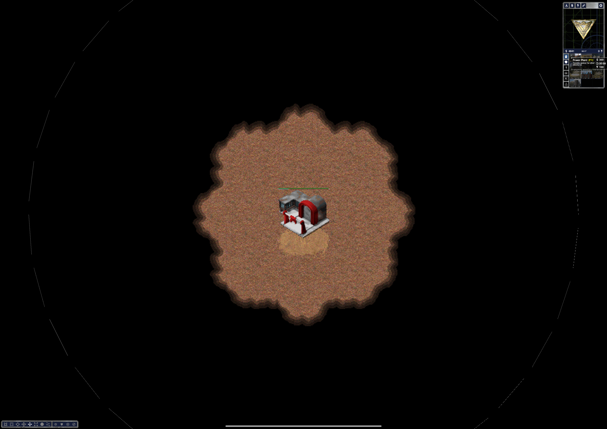

# OpenRA on Android



Native Android port of OpenRA, built with .NET 9 (`net9.0-android`) and raw EGL/GLES — no SDL2, no emulation layer.

## Status

- ✅ Engine + all mods compile and run natively on `arm64-v8a`
- ✅ OpenGL ES 3.2 rendering via EGL (Adreno/Mali tested)
- ✅ Touch input: tap (left-click), double-tap, long-press (right-click), two-finger pan, pinch-to-zoom
- ✅ Soft keyboard for text fields (player name, etc.)
- ✅ Audio via OpenAL-Soft (OpenSL ES backend)
- ✅ Freeware game content auto-download from openra.net mirrors
- ✅ Red Alert main menu + shellmap rendering with live animation

## Architecture

```
OpenRA.Android (net9.0-android, the APK app)
 ├─ OpenRA.Game              (multi-targets net8.0;net9.0-android)
 ├─ OpenRA.Mods.Common/Cnc/D2k (multi-target, compiled-in, no disk loading)
 └─ OpenRA.Platforms.Android (EGL + GLES + touch + OpenAL audio)
```

The Android platform layer (`OpenRA.Platforms.Android`) implements OpenRA's `IPlatform`/`IPlatformWindow`/`IGraphicsContext` interfaces using:
- **EGL** via P/Invoke to `libEGL.so` (context, surface, swap)
- **GLES 3** function-pointer loader (reuses the engine's `OpenGL.cs` with `eglGetProcAddress`)
- **SurfaceView** + `ISurfaceHolderCallback` for the window surface
- **MotionEvent** translation for multi-touch input
- **OpenAL-Soft** for audio (`libsoft_oal.so`, OpenSL ES backend)
- **FreeType** for font rendering (`libfreetype6.so`)

## Build prerequisites

- .NET 9 SDK + `dotnet workload install android`
- Android SDK (API 34+), NDK r27
- JDK 17
- CMake (Android SDK CMake 3.22.1 works)

## Building the native libraries

The three native dependencies (FreeType, Lua, OpenAL-Soft) don't ship Android binaries, so they're built from source with the NDK. All scripts derive every path from their own location and `ANDROID_NDK_ROOT` — there are no hardcoded developer paths — and copy the outputs into `OpenRA.Android/jniLibs/arm64-v8a/`:

```bash
export ANDROID_NDK_ROOT="$HOME/android-sdk/ndk/27.1.12297006"  # or your NDK path
sh thirdparty/build-freetype-android.sh   # → jniLibs/arm64-v8a/libfreetype6.so
sh thirdparty/build-lua-android.sh        # → jniLibs/arm64-v8a/liblua51.so
sh thirdparty/build-openal-android.sh     # → jniLibs/arm64-v8a/libsoft_oal.so
```

The output names are fixed: `libfreetype6.so` (matches `DllImport("freetype6")`), `liblua51.so`
(matches Eluant's `DllImport("lua51")`), and `libsoft_oal.so` (matches OpenAL-CS's
`DllImport("soft_oal")`). `AndroidPlatform.cs` additionally preloads each library through
Java's class loader and installs `NativeLibrary` resolvers, because .NET Android does not
apply legacy `dllmap` config files.

## Testing

- `make tests` runs the deviceless engine test suite (NUnit). The touch gesture state machine
  is pure C# (`OpenRA.Game/Input/TouchGestureMapper.cs`) and is unit-tested in
  `OpenRA.Test/OpenRA.Game/TouchGestureMapperTests.cs` (taps, drags, long-press, pinch,
  cancellation, multi-finger lift ordering).
- `.github/workflows/android.yml` builds the native libraries, verifies they are ARM64,
  builds the Release APK, checks that the three `.so` files are present inside it, scans the
  scripts for hardcoded paths, and uploads the APK as an artifact.
- On-device behaviors (touch feel, audio output switching, backgrounding/rotation, real
  multiplayer) still require manual testing on physical hardware.

## Building and deploying the APK

```bash
export DOTNET_ROOT="$HOME/.dotnet"
export JAVA_HOME="/opt/homebrew/opt/openjdk@17/libexec/openjdk.jdk/Contents/Home"
export ANDROID_SDK_ROOT="$HOME/Library/Android/sdk"
export ANDROID_NDK_ROOT="$HOME/Library/Android/sdk/ndk/27.1.12297006"

# Build, align, sign, install, and launch on a connected device
./thirdparty/deploy-android.sh
```

Or manually:
```bash
dotnet build OpenRA.Android/OpenRA.Android.csproj -c Release -f net9.0-android -p:BuildForAndroid=true

# Sign with debug keystore
APK=OpenRA.Android/obj/Release/android/bin/net.openra.android.apk
zipalign -f -p 4 "$APK" "${APK%.apk}-aligned.apk"
apksigner sign --ks ~/.android/debug.keystore --ks-pass pass:android \
  --out "${APK%.apk}-Signed.apk" "${APK%.apk}-aligned.apk"

adb install -r "${APK%.apk}-Signed.apk"
adb shell am start -n net.openra.android/$(adb shell dumpsys package net.openra.android | grep -oE 'crc[0-9a-f]+\.MainActivity' | head -1)
```

## Touch controls

Gesture logic lives in `OpenRA.Game/Input/TouchGestureMapper.cs` (a deterministic state
machine pumped from the game thread); `AndroidInput.cs` only copies `MotionEvent` values into
a thread-safe queue on the UI thread. Thresholds are tunable fields on the mapper
(`LongPressMs` 500, `TouchSlopPx` 16, `DoubleTapWindowMs` 300, `MinPinchDeltaPx` 2).

| Gesture | Action |
|---|---|
| Tap | Left click |
| Double-tap | Double-click |
| Long-press (>500ms, fires even with a stationary finger) | Right-click |
| Drag | Move / scroll map / drag-select |
| Two-finger drag | Pan map (right-button hold) |
| Pinch | Zoom in/out (Scroll + Ctrl) |

On `ACTION_CANCEL`, pause, or focus loss every held mouse button is released and the gesture
state is reset, so the engine is never left with a stuck button.

## Engine modifications

Changes to the core engine are minimal and guarded by `OperatingSystem.IsAndroid()`:
- `ObjectCreator.cs` — resolves mod assemblies from the default load context (compiled-in)
- `Game.cs` — instantiates `AndroidPlatform` directly; skips LOH compaction (unsupported on Mono)
- `PlatformInterfaces.cs` — added `StartTextInput()`/`StopTextInput()` for soft keyboard
- `Widget.cs` — calls `StartTextInput`/`StopTextInput` on focus gain/loss
- `*.csproj` — multi-target `net8.0;net9.0-android` via `BuildForAndroid` property

Desktop builds are completely unaffected.
